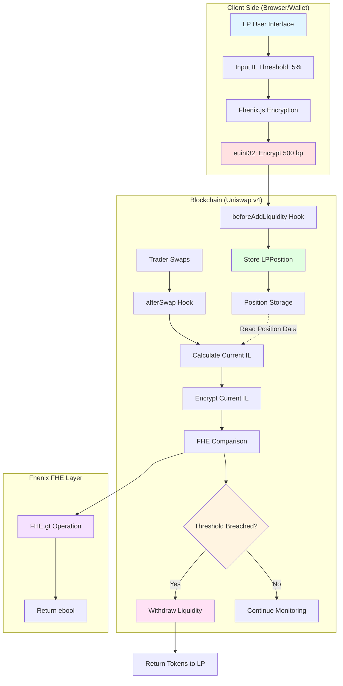
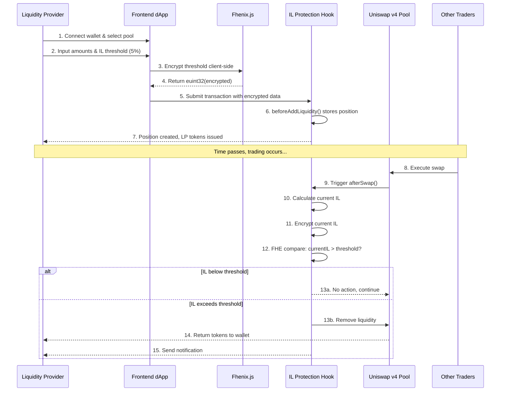
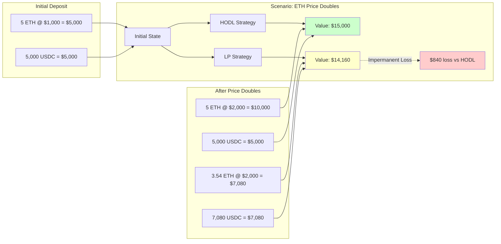
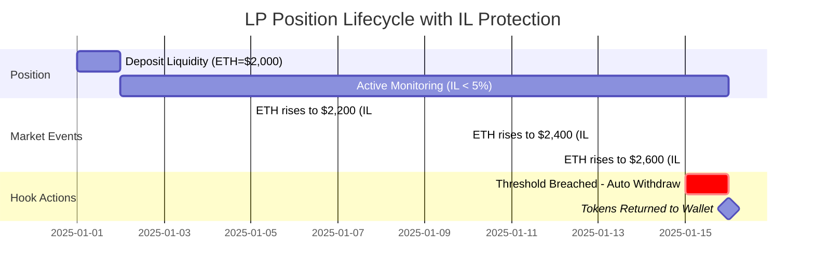
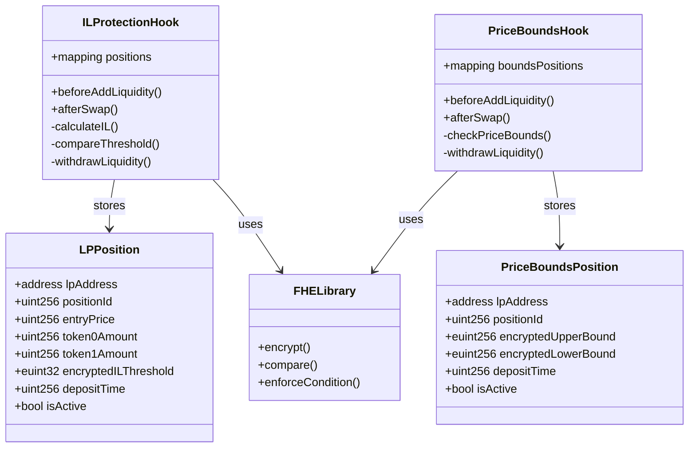
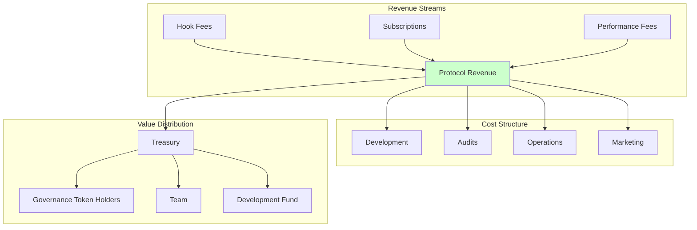
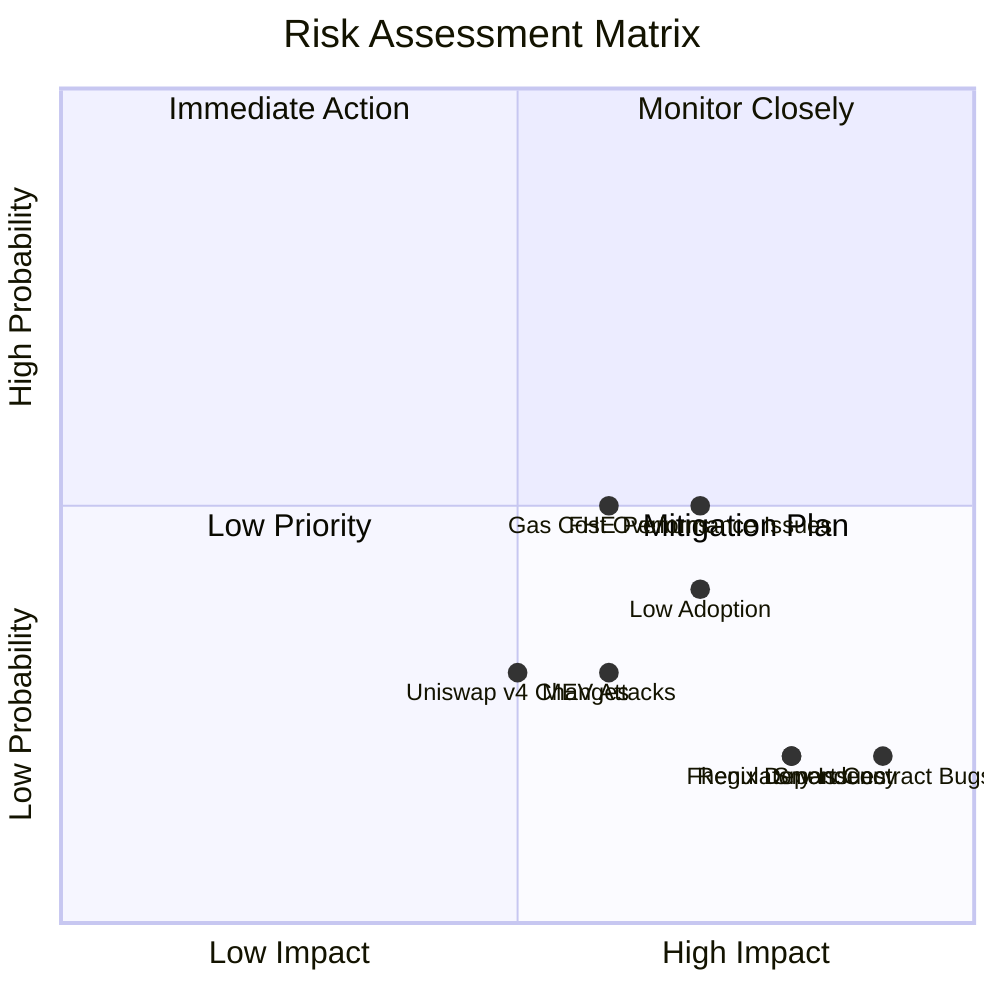
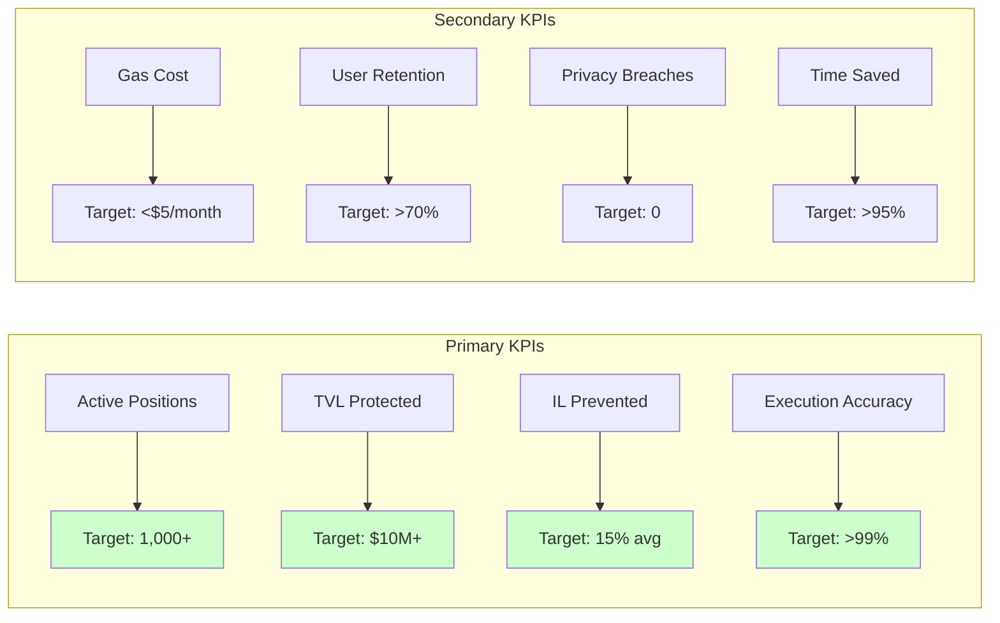
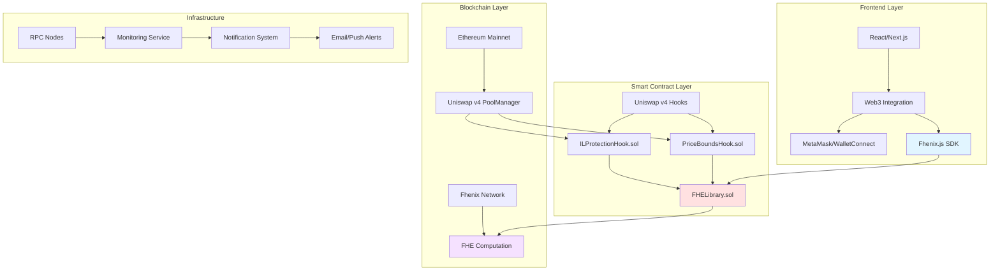

```mermaid
graph TB
    subgraph "Without FHE (Public Thresholds)"
        A1[LP sets threshold: 5%] --> B1[Stored on-chain in plaintext]
        B1 --> C1[MEV bot reads: Alice exits at 5%]
        C1 --> D1[IL approaches 5%]
        D1 --> E1[MEV bot front-runs exit]
        E1 --> F1[Alice loses more money]
    end
    
    subgraph "With FHE (Encrypted Thresholds)"
        A2[LP sets threshold: 5%] --> B2[Encrypted client-side]
        B2 --> C2[Stored as euint32 encrypted]
        C2 --> D2[MEV bot sees: ???]
        D2 --> E2[IL exceeds unknown threshold]
        E2 --> F2[Alice exits at fair price]
    end
    
    style F1 fill:#ffcccc
    style F2 fill:#ccffcc
    style C2 fill:#e1e1ff
```

# Visual Guide: FHE-Protected IL Insurance Hook
## Quick Reference & Diagrams

---

## 🎯 One-Minute Summary

**What:** Automated protection for Uniswap liquidity providers against impermanent loss  
**How:** Smart contracts that monitor your position and auto-exit when losses exceed your private threshold  
**Why:** Privacy-preserving (using FHE encryption) so MEV bots can't front-run your exits  

---

## 📊 System Architecture Diagram



---

## 🔄 User Journey Flow



---

## 💡 Impermanent Loss Visualization



---

## 🔐 Privacy Comparison



---

## 📈 IL Protection in Action

### Example Timeline



---

## 🏗️ Smart Contract Structure



---

## 🎯 Feature Comparison Matrix

| Feature | Traditional LP | Stop-Loss Bot | **FHE Hook** |
|---------|---------------|---------------|--------------|
| **Automated Protection** | ❌ Manual only | ✅ Yes | ✅ Yes |
| **24/7 Monitoring** | ❌ Self-monitor | ✅ Yes | ✅ Yes |
| **Privacy** | N/A | ❌ Public params | ✅ Encrypted |
| **MEV Resistance** | N/A | ❌ Vulnerable | ✅ Protected |
| **Gas Efficiency** | ✅ No overhead | ⚠️ Moderate | ✅ Optimized |
| **Trustless** | ✅ Yes | ❌ Centralized | ✅ Yes |
| **Granular Control** | ❌ Limited | ⚠️ Basic | ✅ Advanced |
| **Setup Complexity** | ✅ Simple | ⚠️ Moderate | ✅ Simple UI |

---

## 💰 Economic Model



---

## 🚦 Risk Matrix



---

## 📊 Success Metrics Dashboard



---

## 🛠️ Technology Stack



---

## 📅 Development Roadmap

```mermaid
timeline
    title Project Timeline (9 Months)
    section Phase 1: Foundation
        Month 1-2 : Smart contract design
                  : FHE proof-of-concept
                  : IL calculation engine
    section Phase 2: Core Dev
        Month 3-4 : Hook implementation
                  : FHE integration
                  : Gas optimization
                  : Unit tests
    section Phase 3: Frontend
        Month 5-6 : React UI development
                  : Wallet integration
                  : Monitoring dashboard
                  : Notifications
    section Phase 4: Testing
        Month 7-8 : Testnet deployment
                  : Beta testing
                  : Security audits
                  : Bug bounty
    section Phase 5: Launch
        Month 9   : Mainnet deployment
                  : Marketing campaign
                  : Community support
```

---

## 🎓 Key Concepts Cheat Sheet

### Impermanent Loss Formula
```
IL = 2 × √(priceRatio) / (1 + priceRatio) - 1

Example:
  Entry: ETH = $2,000
  Current: ETH = $2,500
  Ratio: 2500/2000 = 1.25
  IL = 2 × √1.25 / (1 + 1.25) - 1
     = 2 × 1.118 / 2.25 - 1
     = -0.62% (loss)
```

### Basis Points Conversion
```
Percentage → Basis Points
1% = 100 bp
5% = 500 bp
10% = 1,000 bp
0.01% = 1 bp

Basis Points → Percentage
500 bp = 5%
1,000 bp = 10%
```

### FHE Operations
```solidity
// Encrypt value
euint32 encrypted = FHE.asEuint32(500);

// Compare (greater than)
ebool result = FHE.gt(encryptedA, encryptedB);

// Enforce condition
FHE.req(result); // Reverts if false
```

### Uniswap v4 Price Conversion
```solidity
// sqrtPriceX96 → price
uint256 price = (sqrtPriceX96 ** 2) >> 192;

// price → sqrtPriceX96
uint160 sqrtPrice = uint160(sqrt(price) << 96);
```

---

## 🔗 Quick Links

### Documentation
- [Full PRD](./PRD.md)
- [Detailed Analysis](./PRD_ANALYSIS.md)
- [Uniswap v4 Docs](https://docs.uniswap.org/contracts/v4/overview)
- [Fhenix Docs](https://docs.fhenix.io/)

### Tools
- [IL Calculator](https://dailydefi.org/tools/impermanent-loss-calculator/)
- [Uniswap Analytics](https://info.uniswap.org/)
- [Gas Tracker](https://etherscan.io/gastracker)

### Community
- [Discord](#)
- [Telegram](#)
- [Twitter](#)
- [GitHub](#)

---

## ❓ Quick FAQ

**Q: How much does it cost?**  
A: ~$3-5/month in gas fees per protected position

**Q: Is my threshold really private?**  
A: Yes! Encrypted client-side, never decrypted on-chain

**Q: Can I change my threshold?**  
A: Not in v1. Withdraw and re-deposit with new threshold

**Q: What if I want to exit early?**  
A: Manual withdrawal anytime via Uniswap interface

**Q: Which pools are supported?**  
A: All Uniswap v4 pools (after v4 mainnet launch)

**Q: Is this audited?**  
A: Will be audited by 3 firms before mainnet launch

---

**Document Version:** 1.0  
**Last Updated:** November 26, 2025
